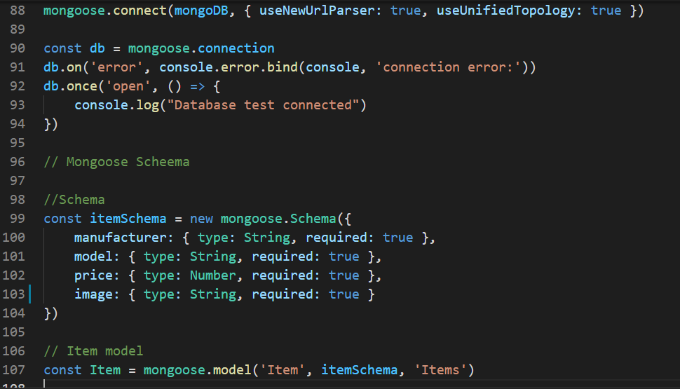
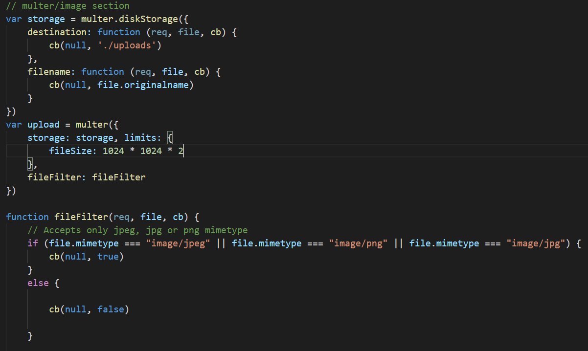
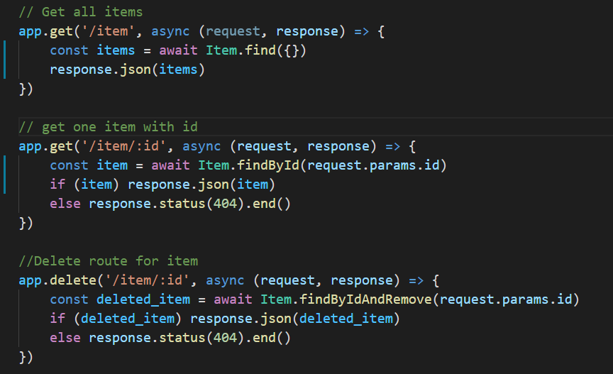
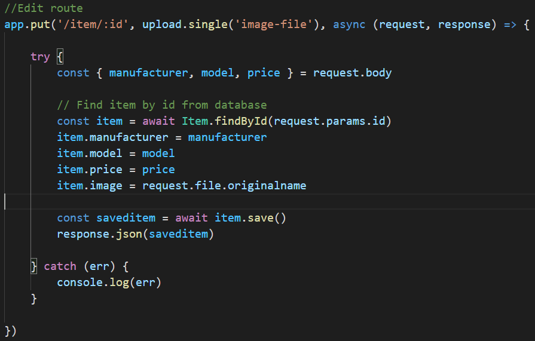
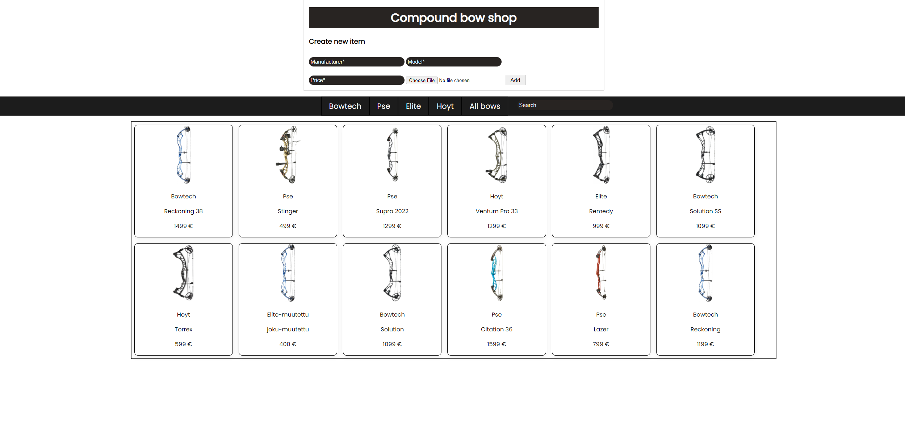
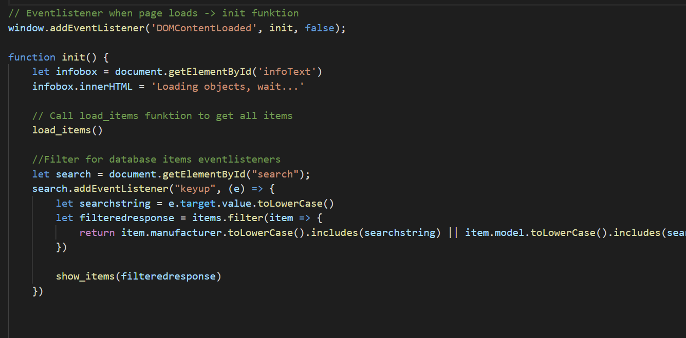
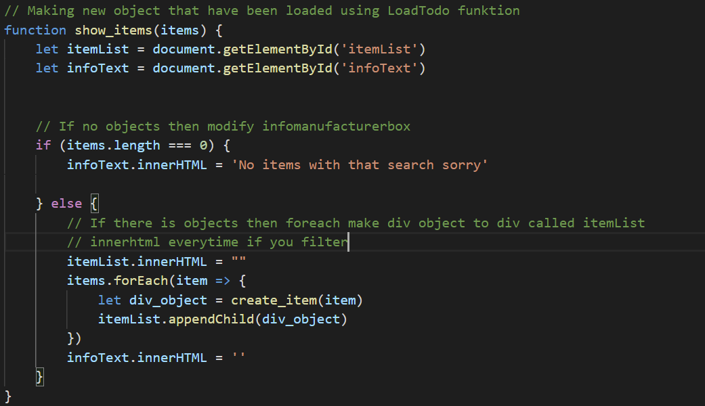
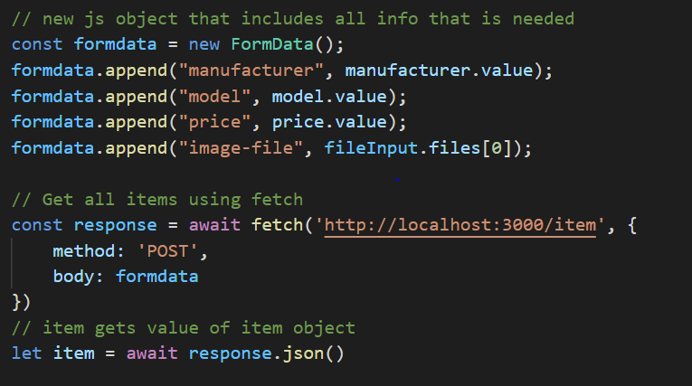
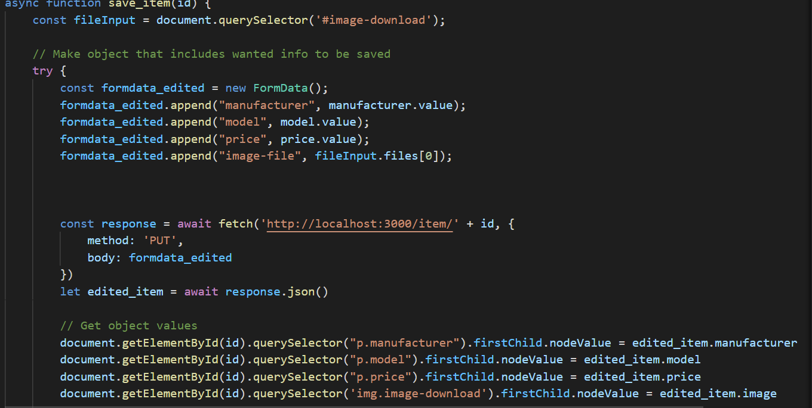

Dokumentaatio Fullstack 

Eero Kantonen AA4106

Tässä projektissani käytän back-endin tekemiseen Nodejs/mongodb ja front-end:ssä käytän ihan vanilla Javascriptiä. Harrastan taljajousiammuntaa, joten oli todella helppo löytää oma aihe harjoitustyöhön. 

Aiheena on taljajousikauppa, jossa tulee kaikki CRUD ominaisuudet esille. Crudissa on siis mahdollista luoda, poistaa, lukea ja päivittää haluttu objekti. Tietoturvaa en tähän työhön laittanut, koska ei ole rahaa pelissä eikä mitään muutakaan menetettävää. Jos olisin halunnut tehdä validaattorin olisin voinut käyttää Googlen Firebasea, mutta totesin sen olevan turha tämän tyyppiseen appiin. Käytin visual studio codea ja kommentoin koodini englanniksi.

Harjoitustyön kannalta tärkeimmät funktiot/piirteet:

Backend

Mongodb scheman luominen, modelin luominen ja yhteyden muodostaminen tietokantaan. Scheman luomisessa on rajoituksia esim. onko se number/string.

Multer mahdollistaa kuvien lähetyksen. Kuvassa nähdään Multerin toiminta. Tehdään oma varasto kuville ja annetaan ehtoja esim. mimetype saa olla vain jpg/png mallia.Huom! Upload funktiota, jossa multer mukana.

Nodejs reitit käyttäen express. 

Edit route oli reiteistä haastavin, mutta siitä selvittiin hyvin. Huom! Upload funktiota, jossa multer mukana.

Frontend

Käyttäjän näkökulma kun avataan ohjelma. Tässä ohjelmassa voit muokata, poistaa tai luoda uuden tavaran kauppaan käyttäen lomaketta. Kaikki tehdään http pyyntöjen kautta, jolloin saadaan mongodb tieto myös ajantasalle.

Ohjelma aloittaa heti kun sivu lautautuu. Heti ladataan nodejs:n kautta kaikki itemit load_items funktiolla.

Load_items funktio kutsuu itemien ladattua show_items funktiota joka saa parametriksi items objectin. Sitten käydään foreach loopilla jokainen item objekti läpi ja tehdään item, joka näkyy html sivulla.

Esitten lyhyesti Post ja Put metodin, koska nämä olivat hieman hankalempia kuin delete/get metodit.

Funktiossa add_item funktio tehdään html sivulla olevalle lomakkeelle tarvittavat tiedot ja painetaan add. Tällöin koodi tekee FormData objektin, joka sisältää lomakkeelta tulevat arvot. Tämä sitten käyttää http protokollaa, jotta nodejs ja mongodb saavat sitten tiedon.

Put metodi eli pystyn muokkaamaan jo tehtyä item objektia. Tässä metodissa meni eniten aikaa, mutta kyllä sitten lopulta onnistuttiin varsin hyvin. Tuli monta uutta asiaa vastaa, jolla pystyy referoimaan tiettyä objektin arvoa quaryllä.

Tässä oli projektini tärkeimmät pääpiirteet, muut ovat mielestäni niin selkeitä niin niihin en paneudu sen enempää.

Ajankäyttö

Todella vaikea arvioida paljon tähän olen kuluttanut aikaa, mutta jos pitäisi arvata niin jossain 30-40h? Tähän sisältyy kaikki eli html/css ja tietysty javascript. Tein projektia monena eri päivänä niin pysyi mielenkiinto mukana. Aikaa meni paljon suunnitteluun ja välillä tuli luovuus vastaan.

Kehityskohteet

Olen kyllä todella tyytyväinen tähän projektiin, jonka sain tehtyä ja opittua. En ole koskaan koodannut javascriptillä niin oli todella paljon opittavaa. Kehityskohteena voisi olla lisätä työhön bootstrap css:n tilalle tai käyttää reactia. Lisäksi syötteiden tarkistus voisi olla laajempaa.

